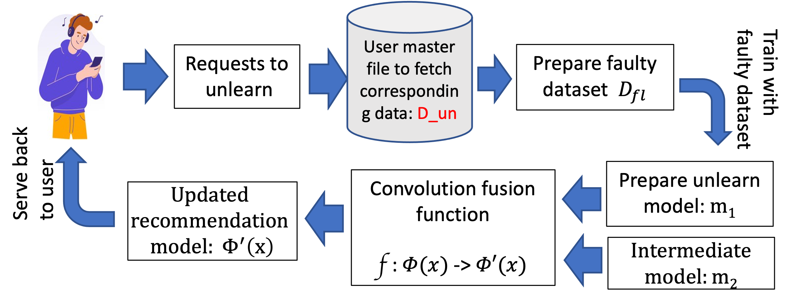
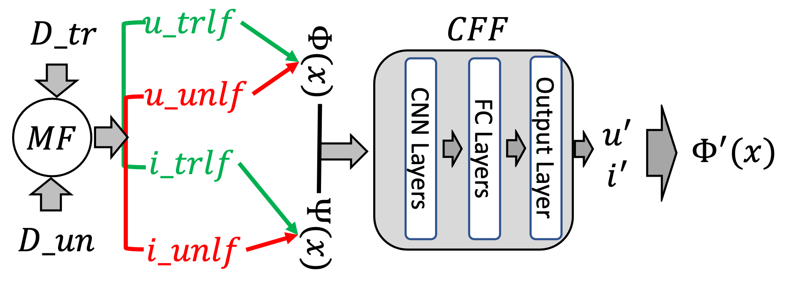
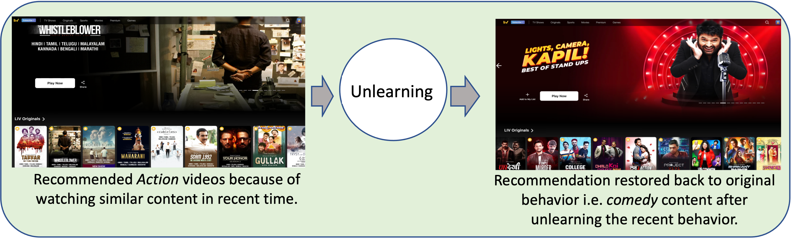

## Unlearning the Unwanted Data from a Personalized Movie Recommendation Model

Recommendation unlearning is the upcoming need at any recommendation system which is serving the user at the moment. 
 
<figcaption> Fig.1: Here is the total number of steps encountered to serve the recommendation unlearning request 
 </figcaption>

 

<figcaption> Fig.2: Unlearning the data using Convolution Fusion Function 
 </figcaption>

## Here are the instructions to set up the code

NOTE: Code provided works well with Pytorch 1.12.1.

Prerequisites:
PyTorch
Pandas
Numpy

### Dataset:
1. MovieLens 100K           https://grouplens.org/datasets/movielens/100k/
2. MovieLens 1M		    https://grouplens.org/datasets/movielens/1m/

### Python files:

1. MF_AI contins the program for Matrix Factorization.
2. con_fusion contains the program for fusion function.
3. M_orig contains the code for original MF based recommedation using Movielens 100K dataset.
4. M_faulty_final contains the code for creating faulty recommendation model, intermediate recommendation model and final model.
5. 1M_um contains code to create a utility matrix using the Movielens 1M dataset. It can be used in place of the Movilens 100K dataset utility matrix creation in the M_orig and M_faulty_final files.

<figure>
  
<figcaption> Fig.3: Application of Unlearning on Video Recommendations </figcaption>
</figure>
